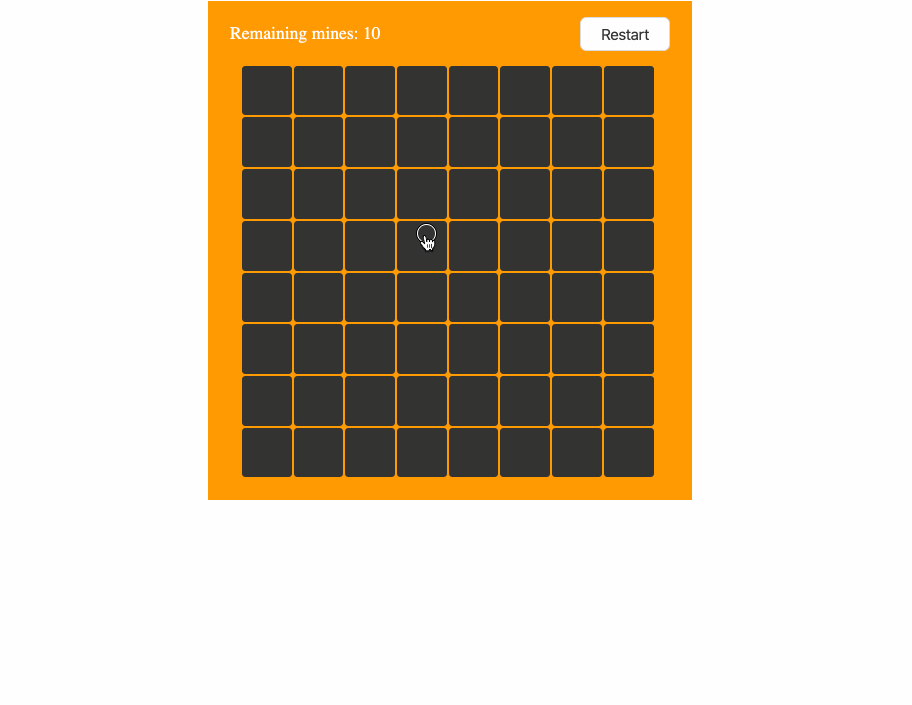

## React Minesweeper ☠️ 🚩
This is a simple [minesweeper game](http://minesweeperonline.com/#beginner) app written in React. The rules are quite straightforward like below.

#### 1. On initial loading
By default,
 - The number of remaining mines ☠️ are set as 10
 - All cells(8 * 8) are hidden
 
#### 2. To start a game, click any cells on the board
 - If you clicked a cell which contains ☠️ inside, the game will be over but you can restart the game by clicking "Restart" btn
 - If it's not, all the surrounded cells will display the number of closest ☠️. If it's 0, it shows nothing
 - On right clicking event, you can mark the cell with 🚩and this will reduce the number of remaining mines from the board
 - You will win the game if you open all the cells except the ☠️ cells OR if you mark all of them \w 🚩
 


## 2. Development

### Tech stack:
+ [npm](https://www.npmjs.com/) for package management
+ [ES6](https://github.com/lukehoban/es6features) via [babel](https://babeljs.io/) as programming language
+ [react](https://facebook.github.io/react), [react-redux](https://react-redux.js.org/), and [redux-thunk](https://github.com/reduxjs/redux-thunk) as core stack
+ [styled-components](https://www.styled-components.com/) for React component styling
+ [jest](https://facebook.github.io/jest) for unit tests
+ [enzyme](https://github.com/airbnb/enzyme) for testing React components
+ [eslint](http://eslint.org/) for js linting

### To run dev mode locally:
```bash
  $ git clone https://github.com/AhyoungRyu/react-minesweeper.git
  $ cd react-minesweeper
  $ npm install
  # After successfull pkg installtion
  $ npm start
```
Now, it will automatically open http://localhost:3000 and show you the basic minesweeper game board on the screen

### To run unit test:
```bash
  $ npm test
```
It will find all files that end on `*.spec.js` under `__tests__` dir and run them
